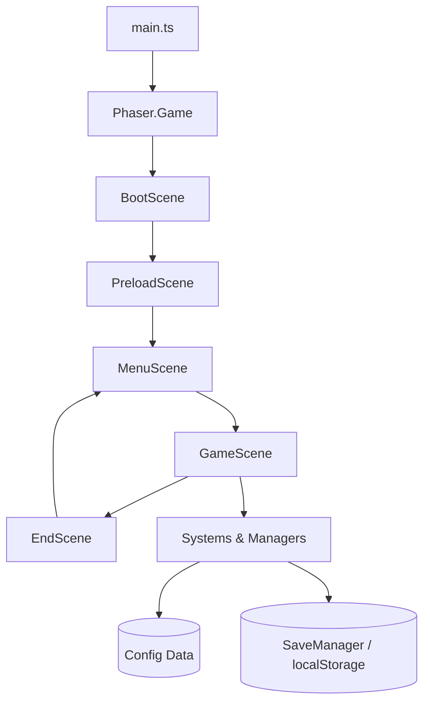

# ONE MORE RUN — Technical Architecture

## Overview

Das Spiel ist eine clientseitige Single-Page-Anwendung auf Basis von **Phaser 3**
und **TypeScript**, gebündelt mit **Vite**. Es gibt keinen Server; sämtlicher
Zustand wird im Browser (`localStorage`) gehalten.



---

## Directory Layout

```
src/
  assets/         Rohdaten (zur Laufzeit generierte Texturen/Sounds zunächst)
    audio/
    sprites/
  config/         Datengetriebene Definitionen (keine Magic Numbers)
    balance.ts    Globale Balancing-Werte
    enemies.ts    Gegner-Definitionen
    upgrades.ts   Upgrade-Definitionen
    synergies.ts  Synergie-Regeln
    weapons.ts    Waffen-Definitionen
  entities/       Spielobjekte (Player, Enemy, Projectile, XPGem, Boss)
  weapons/        Waffenlogik
  upgrades/       Upgrade-Anwendung & Synergie-Auflösung
  systems/        Lose gekoppelte Subsysteme (Spawner, Combat, Leveling)
  managers/       Querschnitt: Audio, Save, Events, Input
  scenes/         Phaser-Szenen (Boot, Preload, Menu, Game, End)
  ui/             HUD, Upgrade-Auswahl, Buttons
  save/           Save-Datenmodell & Serialisierung
  main.ts         Einstiegspunkt, Phaser-Konfiguration
```

---

## Core Principles

- **Keine Magic Numbers** — alle Werte stammen aus `src/config/`.
- **Lose Kopplung** — Systeme kommunizieren über einen zentralen `EventBus`.
- **Datengetrieben** — Gegner, Waffen, Upgrades und Synergien sind Konfiguration.
- **Single Responsibility** — jede Klasse hat eine klar abgegrenzte Aufgabe.

---

## Event System

Ein globaler `EventBus` (Phaser `EventEmitter`) entkoppelt Systeme. Beispiele:

| Event | Payload | Sender → Empfänger |
| ----- | ------- | ------------------ |
| `enemy:killed` | `{ enemy, x, y }` | CombatSystem → Spawner, Stats, Audio |
| `xp:collected` | `{ amount }` | Player → LevelingSystem |
| `level:up` | `{ level }` | LevelingSystem → UI, GameScene |
| `upgrade:chosen` | `{ id }` | UpgradeUI → UpgradeSystem |
| `player:died` | `{ stats }` | Player → GameScene → EndScene |
| `boss:spawned` | `{ boss }` | Spawner → HUD |

---

## Managers

- **AudioManager** — kapselt Howler.js, spielt Feedbacksounds & Musik.
- **SaveManager** — lädt/speichert `SaveData` in `localStorage`, Default-Fallback.
- **EventBus** — zentrale Event-Emitter-Instanz.
- **InputManager** — vereinheitlicht Tastatur, Maus und Touch (virtueller Stick).

---

## Systems (GameScene)

- **SpawnSystem** — erzeugt Gegner anhand der Difficulty Curve.
- **CombatSystem** — Kollisionen, Schaden, Tod, Loot.
- **LevelingSystem** — XP-Kurve, Level-Up, triggert Upgrade-Auswahl.
- **UpgradeSystem** — wendet Upgrades an, löst Synergien auf, hält den Build.

---

## Save Data Model

```ts
interface SaveData {
  version: number;
  meta: {
    coins: number;
    upgrades: Record<string, number>; // permanente Meta-Upgrades
  };
  stats: {
    totalKills: number;
    totalRuns: number;
    bestTimeMs: number;
    highestLevel: number;
  };
  unlocks: string[];
  achievements: string[];
  settings: { muted: boolean; volume: number };
}
```

---

## Build & Deploy

- `npm run dev` — Vite Dev-Server mit HMR.
- `npm run build` — optimiertes Bundle nach `dist/`.
- `npm run preview` — lokaler Test des Production-Builds.
- Deployment: statisches Hosting (Cloudflare Pages / GitHub Pages).
- PWA: `vite-plugin-pwa` erzeugt Service Worker + Manifest für Offline-Betrieb.
